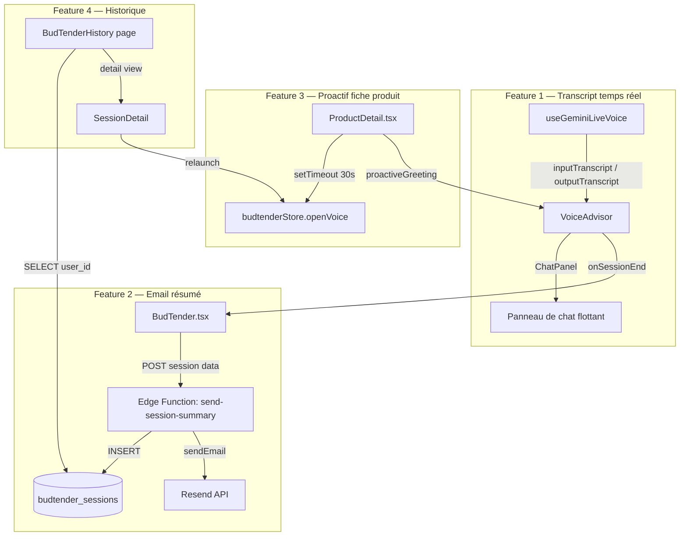

# Design Document — BudTender AI Enhancements

## Overview

Ce document décrit l'architecture et les décisions techniques pour les 4 améliorations du BudTender IA de Green-mood. Ces fonctionnalités s'appuient sur la stack existante (React 19 + TypeScript 5.8, Supabase, Gemini Live WebSocket) et étendent les composants `VoiceAdvisor`, `BudTender`, `ProductDetail`, et `Account` sans les réécrire.

Les 4 fonctionnalités sont :
1. **Mode texte + voix simultané** — Transcript temps réel dans VoiceAdvisor
2. **Résumé de session IA par email** — Edge Function Deno + Resend + table `budtender_sessions`
3. **BudTender proactif sur la fiche produit** — Timer 30s dans ProductDetail
4. **Historique de conversations consultable** — Route `/compte/budtender-historique`

---

## Architecture

### Vue d'ensemble des flux



### Principes architecturaux

- **Pas de refactoring des composants existants** : les modifications sont additives (nouveaux props, nouveaux états, nouveaux composants enfants).
- **Isolation des responsabilités** : la logique de session (sauvegarde, email) est dans une Edge Function, pas dans le client.
- **Sécurité par RLS** : la table `budtender_sessions` est protégée par Row Level Security — chaque utilisateur ne voit que ses propres sessions.
- **Dégradation gracieuse** : si l'Edge Function échoue, la session vocale n'est pas bloquée.

---

## Components and Interfaces

### Feature 1 — Transcript temps réel

#### Modifications de `useGeminiLiveVoice`

Le hook expose déjà `inputTranscript` et `outputTranscript` comme état React (ligne 327-328), mais ne les retourne pas. Il faut :

1. Identifier où `setInputTranscript` / `setOutputTranscript` sont appelés dans le traitement des messages Gemini Live (dans le handler `onmessage` du WebSocket).
2. Ajouter `inputTranscript` et `outputTranscript` au `return` du hook.
3. Réinitialiser les transcripts à `''` au démarrage d'une nouvelle session (`startSession`).

```typescript
// Ajout au return de useGeminiLiveVoice
return {
  voiceState, error, isMuted, isSupported, compatibilityError,
  toolActivity, startSession, stopSession, toggleMute,
  inputTranscript,   // ← nouveau
  outputTranscript,  // ← nouveau
};
```

#### Nouveau composant `TranscriptPanel`

Composant enfant de `VoiceAdvisor`, affiché dans le panneau flottant sous les contrôles existants.

```typescript
interface TranscriptMessage {
  role: 'user' | 'assistant';
  text: string;
  timestamp: number;
}

interface TranscriptPanelProps {
  messages: TranscriptMessage[];
}
```

**Logique d'accumulation des messages** dans `VoiceAdvisor` :

```typescript
// Dans VoiceAdvisor, on accumule les messages à partir des transcripts
const [messages, setMessages] = useState<TranscriptMessage[]>([]);
const prevInputRef = useRef('');
const prevOutputRef = useRef('');

useEffect(() => {
  if (inputTranscript && inputTranscript !== prevInputRef.current) {
    const trimmed = inputTranscript.trim();
    if (trimmed) {
      setMessages(prev => {
        // Mettre à jour le dernier message user si en cours, sinon ajouter
        const last = prev[prev.length - 1];
        if (last?.role === 'user') {
          return [...prev.slice(0, -1), { ...last, text: trimmed }];
        }
        return [...prev, { role: 'user', text: trimmed, timestamp: Date.now() }];
      });
    }
    prevInputRef.current = inputTranscript;
  }
}, [inputTranscript]);

// Idem pour outputTranscript avec role 'assistant'
```

**Auto-scroll** : `useEffect` sur `messages` qui appelle `scrollRef.current?.scrollTo({ top: scrollRef.current.scrollHeight, behavior: 'smooth' })`.

**Persistance post-session** : les messages ne sont pas réinitialisés quand `voiceState` revient à `idle`. Ils sont réinitialisés uniquement quand `isOpen` passe à `false` (fermeture du panneau).

#### Modifications de `VoiceAdvisor`

- Ajouter `inputTranscript` et `outputTranscript` dans la déstructuration du hook.
- Ajouter le state `messages: TranscriptMessage[]`.
- Rendre `<TranscriptPanel messages={messages} />` sous le bloc "Body" existant, visible uniquement si `messages.length > 0`.
- Agrandir légèrement le panneau flottant (max-height avec scroll interne).

### Feature 2 — Résumé de session IA par email

#### Nouvelle table PostgreSQL `budtender_sessions`

```sql
CREATE TABLE budtender_sessions (
  id            UUID PRIMARY KEY DEFAULT gen_random_uuid(),
  user_id       UUID NOT NULL REFERENCES auth.users(id) ON DELETE CASCADE,
  started_at    TIMESTAMPTZ NOT NULL,
  ended_at      TIMESTAMPTZ NOT NULL,
  duration_sec  INTEGER NOT NULL,
  transcript    JSONB NOT NULL DEFAULT '[]',
  -- [{ role: 'user'|'assistant', text: string, timestamp: number }]
  recommended_products JSONB NOT NULL DEFAULT '[]',
  -- [{ id: string, name: string, price: number, slug: string }]
  email_sent    BOOLEAN NOT NULL DEFAULT false,
  created_at    TIMESTAMPTZ NOT NULL DEFAULT now()
);

-- RLS
ALTER TABLE budtender_sessions ENABLE ROW LEVEL SECURITY;

CREATE POLICY "Users see own sessions"
  ON budtender_sessions FOR SELECT
  USING (auth.uid() = user_id);

CREATE POLICY "Users insert own sessions"
  ON budtender_sessions FOR INSERT
  WITH CHECK (auth.uid() = user_id);
```

#### Nouvelle Edge Function `send-session-summary`

**Chemin** : `supabase/functions/send-session-summary/index.ts`

**Déclenchement** : appelée depuis `BudTender.tsx` via `fetch` après la fin d'une session.

**Interface d'entrée** :

```typescript
interface SessionSummaryPayload {
  user_id: string;
  user_email: string;
  user_name: string;
  started_at: string;       // ISO 8601
  ended_at: string;         // ISO 8601
  duration_sec: number;
  transcript: TranscriptMessage[];
  recommended_products: RecommendedProduct[];
  store_name: string;
  budtender_name: string;
}

interface RecommendedProduct {
  id: string;
  name: string;
  price: number;
  slug: string;
}
```

**Logique** :

```
1. Valider le payload (user_id requis, duration_sec >= 10)
2. INSERT dans budtender_sessions
3. Si RESEND_API_KEY présent :
   a. Générer le HTML de l'email (template inline)
   b. Appeler Resend API
   c. UPDATE budtender_sessions SET email_sent = true
4. Retourner { success: true, session_id }
```

**Gestion d'erreur** : try/catch autour de l'envoi email — l'INSERT en base réussit même si l'email échoue.

#### Modifications de `BudTender.tsx`

Ajouter un callback `onSessionEnd` passé à `VoiceAdvisor`, qui reçoit les données de session :

```typescript
interface SessionEndData {
  startedAt: number;
  endedAt: number;
  transcript: TranscriptMessage[];
  recommendedProducts: RecommendedProduct[];
}
```

Dans `BudTender.tsx`, ce callback :
1. Récupère l'utilisateur depuis `authStore` (si non authentifié → skip).
2. Calcule `duration_sec = (endedAt - startedAt) / 1000`.
3. Si `duration_sec < 10` → skip.
4. Appelle l'Edge Function en fire-and-forget (pas d'`await` bloquant).

#### Détection des produits recommandés

Dans `VoiceAdvisor` / `useGeminiLiveVoice`, les produits recommandés sont déjà trackés via `viewedProductIdsRef`. On expose une liste `recommendedProducts` (produits sur lesquels `view_product` ou `add_to_cart` a été appelé) dans le callback `onSessionEnd`.

### Feature 3 — BudTender proactif sur la fiche produit

#### Modifications de `ProductDetail.tsx`

Ajouter un `useEffect` avec timer :

```typescript
const proactiveTriggeredRef = useRef(false);
const proactiveTimerRef = useRef<ReturnType<typeof setTimeout> | null>(null);

useEffect(() => {
  // Guards
  if (!product) return;
  if (!globalSettings?.budtender_voice_enabled) return;
  if (isVoiceOpen) return;
  if (proactiveTriggeredRef.current) return;

  proactiveTimerRef.current = setTimeout(() => {
    if (!isVoiceOpen && !proactiveTriggeredRef.current) {
      proactiveTriggeredRef.current = true;
      // Construire le message de bienvenue contextuel
      const greeting = buildProactiveGreeting(product, globalSettings);
      // Ouvrir le BudTender avec le greeting proactif
      openVoice();
      // Le greeting est passé via le store ou un prop dédié
    }
  }, 30_000);

  return () => {
    if (proactiveTimerRef.current) clearTimeout(proactiveTimerRef.current);
  };
}, [product?.id, isVoiceOpen, globalSettings?.budtender_voice_enabled]);
```

**Fonction `buildProactiveGreeting`** :

```typescript
function buildProactiveGreeting(product: Product, settings: Settings): string {
  const name = product.name;
  const cbd = (product as any).cbd_percentage;
  const price = product.price.toFixed(2);
  const category = product.category?.name || 'CBD';
  
  return `Bonjour ! Je vois que vous consultez ${name}${cbd ? ` (${cbd}% CBD)` : ''} à ${price}€. Puis-je vous aider à en savoir plus sur ses effets, son dosage ou vous proposer des alternatives dans la catégorie ${category} ?`;
}
```

#### Passage du greeting proactif

Le greeting est passé via un nouveau champ dans `budtenderStore` :

```typescript
// budtenderStore.ts — ajout
proactiveGreeting: string | null;
setProactiveGreeting: (greeting: string | null) => void;
```

`VoiceAdvisor` lit `proactiveGreeting` depuis le store et le passe à `useGeminiLiveVoice` via le prop `proactiveGreeting` (déjà défini dans l'interface `Options` du hook, ligne ~270).

**Reset** : le greeting est effacé après que la session démarre (dans `startSession`).

### Feature 4 — Historique de conversations consultable

#### Nouvelle page `BudTenderHistory`

**Chemin** : `src/pages/BudTenderHistory.tsx`

**Route** : `/compte/budtender-historique` (ajout dans `App.tsx` dans le bloc `ProtectedRoute`)

**Structure de la page** :

```
AccountPageLayout (sidebar + main)
└── BudTenderHistory
    ├── Header (titre + filtres période)
    ├── SessionList (liste des sessions)
    │   └── SessionCard × N
    └── SessionDetail (vue détaillée, conditionnelle)
        ├── TranscriptView (messages user/assistant)
        └── RecommendedProductsGrid
            └── ProductLink × N
```

#### Composant `SessionCard`

Affiche pour chaque session :
- Date et heure formatées (`toLocaleDateString('fr-FR', { ... })`)
- Durée formatée (`Xm Ys`)
- Nombre de messages (`transcript.length`)
- Aperçu du premier message assistant (tronqué à 80 caractères)

#### Filtres par période

```typescript
type PeriodFilter = '7d' | '30d' | 'all';

function filterSessionsByPeriod(sessions: BudTenderSession[], period: PeriodFilter): BudTenderSession[] {
  if (period === 'all') return sessions;
  const cutoff = new Date();
  cutoff.setDate(cutoff.getDate() - (period === '7d' ? 7 : 30));
  return sessions.filter(s => new Date(s.started_at) >= cutoff);
}
```

#### Requête Supabase

```typescript
const { data, error } = await supabase
  .from('budtender_sessions')
  .select('*')
  .eq('user_id', user.id)
  .order('started_at', { ascending: false });
```

La RLS garantit l'isolation — le filtre `.eq('user_id', user.id)` est une défense en profondeur.

#### Bouton "Relancer avec contexte"

Dans la vue détaillée, un bouton ouvre le BudTender avec un greeting pré-chargé basé sur la session précédente :

```typescript
const relaunchGreeting = `Bonjour ! Lors de notre dernière conversation le ${formatDate(session.started_at)}, nous avons discuté de ${session.recommended_products.map(p => p.name).join(', ')}. Souhaitez-vous continuer sur ce sujet ou explorer autre chose ?`;
```

#### Ajout de la tuile dans `Account.tsx`

```typescript
// Dans le tableau services de Account.tsx
{
  icon: MessageSquare,  // lucide-react
  label: 'Historique BudTender',
  description: 'Vos conversations passées',
  to: '/compte/budtender-historique',
  accentHex: '#10b981',
  size: 'large',
}
```

#### Ajout dans `AccountSidebar.tsx`

```typescript
{ icon: MessageSquare, label: 'Historique IA', to: '/compte/budtender-historique' }
```

---

## Data Models

### `budtender_sessions` (PostgreSQL)

| Colonne | Type | Description |
|---|---|---|
| `id` | `UUID` | Clé primaire |
| `user_id` | `UUID` | Référence `auth.users(id)` |
| `started_at` | `TIMESTAMPTZ` | Début de session |
| `ended_at` | `TIMESTAMPTZ` | Fin de session |
| `duration_sec` | `INTEGER` | Durée en secondes |
| `transcript` | `JSONB` | `TranscriptMessage[]` |
| `recommended_products` | `JSONB` | `RecommendedProduct[]` |
| `email_sent` | `BOOLEAN` | Email envoyé avec succès |
| `created_at` | `TIMESTAMPTZ` | Horodatage d'insertion |

### `TranscriptMessage` (TypeScript)

```typescript
interface TranscriptMessage {
  role: 'user' | 'assistant';
  text: string;
  timestamp: number; // Unix ms
}
```

### `RecommendedProduct` (TypeScript)

```typescript
interface RecommendedProduct {
  id: string;
  name: string;
  price: number;
  slug: string;
}
```

### `BudTenderSession` (TypeScript — côté client)

```typescript
interface BudTenderSession {
  id: string;
  user_id: string;
  started_at: string;
  ended_at: string;
  duration_sec: number;
  transcript: TranscriptMessage[];
  recommended_products: RecommendedProduct[];
  email_sent: boolean;
  created_at: string;
}
```

### Modifications de `BudtenderStore`

```typescript
interface BudtenderStore {
  isVoiceOpen: boolean;
  activeProduct: (...) | null;
  proactiveGreeting: string | null;  // ← nouveau
  openVoice: () => void;
  closeVoice: () => void;
  toggleVoice: () => void;
  setActiveProduct: (...) => void;
  setProactiveGreeting: (greeting: string | null) => void;  // ← nouveau
}
```

---

## Correctness Properties

*A property is a characteristic or behavior that should hold true across all valid executions of a system — essentially, a formal statement about what the system should do. Properties serve as the bridge between human-readable specifications and machine-verifiable correctness guarantees.*

### Property 1 : Transcript message rendering

*For any* non-empty, non-whitespace-only string received as `inputTranscript` or `outputTranscript`, the transcript panel should contain exactly one message with the corresponding role (`user` or `assistant`) and that text content.

**Validates: Requirements 1.2, 1.3**

### Property 2 : Whitespace messages are filtered

*For any* string composed entirely of whitespace characters (spaces, tabs, newlines), it should not appear as a message in the transcript panel — the message list should remain unchanged.

**Validates: Requirements 1.7**

### Property 3 : Email template completeness

*For any* valid session data (non-empty user name, valid date, any list of recommended products including empty), the rendered email HTML should contain the user's name, the session date, the store name, and the budtender name.

**Validates: Requirements 2.2, 2.7**

### Property 4 : Session duration guard

*For any* session duration value, if `duration_sec < 10` then the email send function should not be called; if `duration_sec >= 10` and the user is authenticated, the email send function should be called exactly once.

**Validates: Requirements 2.5**

### Property 5 : Session data persistence completeness

*For any* valid session payload (user_id, transcript array, recommended_products array, duration, timestamps), the record inserted into `budtender_sessions` should contain all required fields with their correct values.

**Validates: Requirements 2.10**

### Property 6 : Proactive greeting contains product name

*For any* product with a non-empty name, the generated proactive greeting string should contain that product name as a substring.

**Validates: Requirements 3.2**

### Property 7 : Session list sorted by date descending

*For any* collection of `BudTenderSession` records with distinct `started_at` timestamps, the filtered and rendered list should always present sessions in descending chronological order (most recent first).

**Validates: Requirements 4.2**

### Property 8 : Session card displays required fields

*For any* `BudTenderSession` record, the rendered `SessionCard` component should display the session date, duration, message count, and a non-empty preview of the first assistant message (when one exists).

**Validates: Requirements 4.3**

### Property 9 : Period filter correctness

*For any* collection of sessions and any filter period (`7d`, `30d`, `all`), every session in the filtered result should have a `started_at` timestamp within the selected period, and no session outside the period should appear in the result.

**Validates: Requirements 4.5**

### Property 10 : Recommended products rendered as links

*For any* session with a non-empty `recommended_products` array, each product in that array should be rendered as an anchor element whose `href` contains the product's slug.

**Validates: Requirements 4.8**

---

## Error Handling

### Feature 1 — Transcript

- **Transcript vide** : filtré avant affichage (`.trim()` + vérification longueur > 0).
- **Re-renders fréquents** : le `TranscriptPanel` utilise `React.memo` pour éviter les re-renders inutiles. L'accumulation des messages se fait via `useRef` pour les valeurs précédentes, évitant les closures stales.
- **Scroll sur composant démonté** : le `useEffect` d'auto-scroll vérifie `scrollRef.current` avant d'appeler `scrollTo`.

### Feature 2 — Email

- **Edge Function indisponible** : le `fetch` dans `BudTender.tsx` est dans un `try/catch` — l'erreur est loggée en console, la session vocale n'est pas affectée.
- **Resend API failure** : l'Edge Function catch l'erreur Resend, log l'erreur, et retourne `{ success: false, email_error: message }` sans throw. L'INSERT en base a déjà eu lieu.
- **Payload trop grand** : le transcript est tronqué à 500 messages maximum avant envoi à l'Edge Function.
- **Utilisateur non authentifié** : vérifié côté client avant l'appel à l'Edge Function. L'Edge Function vérifie également le JWT Supabase.

### Feature 3 — Proactif

- **Changement de produit** : le `useEffect` a `product?.id` dans ses dépendances — le timer est annulé et recréé si le produit change (navigation entre fiches produit sans rechargement de page).
- **BudTender déjà ouvert** : le guard `if (isVoiceOpen) return` dans le `useEffect` empêche le déclenchement si l'utilisateur a déjà ouvert le BudTender.
- **Démontage rapide** : le cleanup du `useEffect` appelle `clearTimeout` — pas de fuite mémoire.

### Feature 4 — Historique

- **Sessions vides** : état vide explicite avec message d'invitation et lien vers le catalogue.
- **Erreur de chargement** : état d'erreur avec message et bouton "Réessayer".
- **Session sans messages assistant** : l'aperçu affiche "Conversation démarrée" si aucun message assistant n'est trouvé.
- **Produits supprimés** : les liens vers les fiches produit peuvent pointer vers des produits supprimés — afficher le nom du produit sans lien si le slug n'est plus valide (gestion 404 côté ProductDetail existante).

---

## Testing Strategy

### Approche duale

Les tests sont organisés en deux catégories complémentaires :

**Tests unitaires (exemples)** : vérifient des comportements spécifiques avec des données concrètes — interactions UI, guards conditionnels, états vides, gestion d'erreurs.

**Tests de propriétés (property-based)** : vérifient des invariants universels sur des données générées aléatoirement — rendu de transcripts, filtrage, tri, templates d'email.

### Bibliothèque PBT

**fast-check** (npm) — compatible TypeScript, intégration Vitest native.

```typescript
import fc from 'fast-check';
import { describe, it, expect } from 'vitest';
```

Chaque test de propriété tourne avec un minimum de **100 itérations** (`numRuns: 100`).

### Tag format

Chaque test de propriété est annoté :
```typescript
// Feature: budtender-ai-enhancements, Property N: <property_text>
```

### Tests par feature

#### Feature 1 — Transcript

```typescript
// Property 1 — Transcript message rendering
// Feature: budtender-ai-enhancements, Property 1: Transcript message rendering
it('renders non-empty transcript messages with correct role', () => {
  fc.assert(fc.property(
    fc.string({ minLength: 1 }).filter(s => s.trim().length > 0),
    fc.constantFrom('user' as const, 'assistant' as const),
    (text, role) => {
      // render TranscriptPanel with one message
      // assert message appears with correct role class
    }
  ), { numRuns: 100 });
});

// Property 2 — Whitespace filtering
// Feature: budtender-ai-enhancements, Property 2: Whitespace messages are filtered
it('does not render whitespace-only messages', () => {
  fc.assert(fc.property(
    fc.stringOf(fc.constantFrom(' ', '\t', '\n', '\r')),
    (whitespace) => {
      // attempt to add whitespace message
      // assert message list is unchanged
    }
  ), { numRuns: 100 });
});
```

#### Feature 2 — Email

```typescript
// Property 3 — Email template completeness
// Feature: budtender-ai-enhancements, Property 3: Email template completeness
it('email template contains all required fields', () => {
  fc.assert(fc.property(
    fc.record({
      userName: fc.string({ minLength: 1 }),
      storeName: fc.string({ minLength: 1 }),
      budtenderName: fc.string({ minLength: 1 }),
      startedAt: fc.date(),
      products: fc.array(fc.record({
        name: fc.string({ minLength: 1 }),
        price: fc.float({ min: 0.01, max: 999 }),
        slug: fc.string({ minLength: 1 }),
      })),
    }),
    ({ userName, storeName, budtenderName, startedAt, products }) => {
      const html = renderEmailTemplate({ userName, storeName, budtenderName, startedAt, products });
      expect(html).toContain(userName);
      expect(html).toContain(storeName);
      expect(html).toContain(budtenderName);
    }
  ), { numRuns: 100 });
});

// Property 4 — Duration guard
// Feature: budtender-ai-enhancements, Property 4: Session duration guard
it('does not send email for sessions shorter than 10 seconds', () => {
  fc.assert(fc.property(
    fc.integer({ min: 0, max: 9 }),
    (durationSec) => {
      const sendEmail = vi.fn();
      handleSessionEnd({ durationSec, userId: 'user-1', sendEmail });
      expect(sendEmail).not.toHaveBeenCalled();
    }
  ), { numRuns: 100 });
});
```

#### Feature 4 — Historique

```typescript
// Property 7 — Sorted by date descending
// Feature: budtender-ai-enhancements, Property 7: Session list sorted by date descending
it('always displays sessions in descending chronological order', () => {
  fc.assert(fc.property(
    fc.array(fc.record({
      id: fc.uuid(),
      started_at: fc.date().map(d => d.toISOString()),
      // ... other fields
    }), { minLength: 2, maxLength: 20 }),
    (sessions) => {
      const sorted = sortSessions(sessions);
      for (let i = 0; i < sorted.length - 1; i++) {
        expect(new Date(sorted[i].started_at).getTime())
          .toBeGreaterThanOrEqual(new Date(sorted[i + 1].started_at).getTime());
      }
    }
  ), { numRuns: 100 });
});

// Property 9 — Period filter correctness
// Feature: budtender-ai-enhancements, Property 9: Period filter correctness
it('period filter only returns sessions within the selected period', () => {
  fc.assert(fc.property(
    fc.array(fc.record({ started_at: fc.date().map(d => d.toISOString()) })),
    fc.constantFrom('7d' as const, '30d' as const, 'all' as const),
    (sessions, period) => {
      const filtered = filterSessionsByPeriod(sessions, period);
      if (period === 'all') {
        expect(filtered.length).toBe(sessions.length);
      } else {
        const days = period === '7d' ? 7 : 30;
        const cutoff = Date.now() - days * 24 * 60 * 60 * 1000;
        filtered.forEach(s => {
          expect(new Date(s.started_at).getTime()).toBeGreaterThanOrEqual(cutoff);
        });
      }
    }
  ), { numRuns: 100 });
});
```

### Tests d'intégration

- **Edge Function** : test d'intégration avec Supabase local (via `supabase start`) vérifiant l'INSERT en base et l'appel Resend mocké.
- **RLS** : test vérifiant qu'un utilisateur ne peut pas lire les sessions d'un autre utilisateur.
- **Route protégée** : test e2e Playwright vérifiant la redirection vers `/connexion` pour un utilisateur non authentifié tentant d'accéder à `/compte/budtender-historique`.
